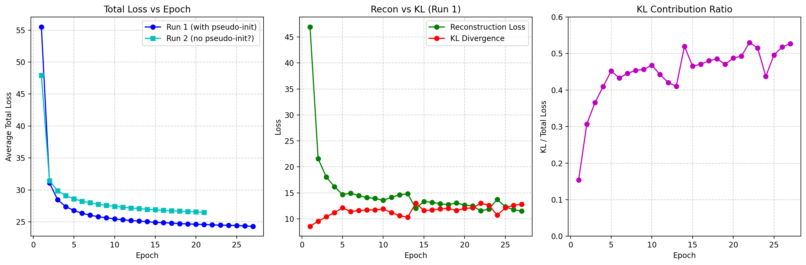
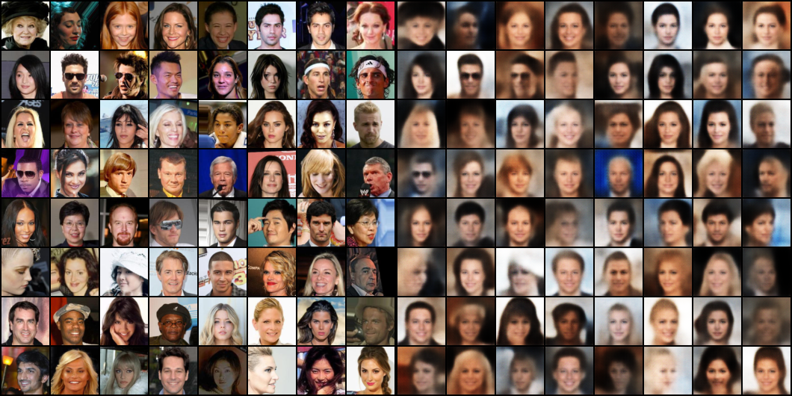

# VAE-VampAlign: 基于 VampPrior 的变分自编码器研究

> 本项目实现了一种改进的变分自编码器（VAE），引入 **VampPrior** 和 **KL annealing** 策略，并结合深度残差网络提升生成质量。适用于 CelebA 和 MNIST 数据集的图像重建与生成任务。

---

## 📁 项目目录结构
```
VAE-VampAlign/
├── data/                 # 数据加载相关
│   └── data_loaders.py
├── figures/              # 训练结果图、生成样本图
│   ├── celeba_kl_ratio.png
│   ├── celeba_loss_curve.png
│   ├── reconstruction.png
│   └── vae_mnist_training_analysis.png
├── models/               # 模型定义
│   ├── encoder.py        # 编码器（ResNet-based）
│   ├── decoder.py        # 解码器（ResNet-based）
│   └── vamp_vae.py       # VampPrior-VAE 主模型
├── results/              # 存放训练过程中生成的图像（当前已有示例图像）
├── utils/                # 工具函数
│   ├── loss.py           # 损失函数计算
│   ├── loss_curve_celebA.py
│   └── loss_curve_mnist.py
├── config.yaml           # 全局配置文件，定义数据路径、模型超参数（如 latent_dim、pseudo_inputs）、训练设置（epochs、batch_size、learning_rate）及 KL annealing 策略
├── train.py              # 主训练脚本：加载配置、初始化模型/优化器、执行训练循环、定期保存 checkpoint 和 result 结果
├── eval.py               # （定量）评估脚本：加载训练好的模型，
├── mnist_generation.py   # （定性）专门针对 MNIST 数据集的生成脚本，用于快速测试或展示模型在 MNIST 上的生成能力
└── celebA_generation.py  # （定性）专门针对 CelebA 数据集的生成脚本，用于快速测试或展示模型在 CelebA 上的生成能力
```

## 🔧 启动方式

### 1.训练
首先需要安装pytroch等包；

接着需要设置config.yaml的超参数，例如batch_size、lr 、input_size（分辨率，目前为64，可以修改为128）

最后在项目根目录下执行以下命令以开始训练：

```
python train.py
```

### 生成结果（定性评估）
生成mnist图像样本

```
python mnist_generation.py
```

生成celebA图像样本
```
python celebA_generation.py
```

### 评估指标（定量评估）
需要有训练好的模型权重，设置路径后运行
```
python eval.py
```

预期结果会输出Active Units和LPIPS分数。

## 🖼 预期结果展示

### 1. MNIST 实验结果
在基础数据集上，VampPrior 显著提升了潜在空间的表达精度，数字边缘更加锐利。

| 指标 (MNIST) | 标准 VAE (Gaussian) | **VampVAE (Ours)** |
| :--- | :---: | :---: |
| **Active Units (活跃维度)** | 14 / 40 | **34 / 40** |
| **LPIPS (感知相似度)** | 0.0394 | **0.0372** |


*图：MNIST 训练曲线及重建对比*

---

### 2. CelebA 实验结果 (64x64 分辨率)
在复杂人脸任务中，通过 **ResNet + KL Annealing**，模型克服了“平均脸”问题，实现了高质量重构。

#### 📊 定量指标
| 模型配置 | Active Units ↑ | LPIPS (感知距离) ↓ |
| :--- | :---: | :---: |
| 基线 (Conv VAE) | 238 / 256 | 0.3888 |
| **改进 (ResNet + VampPrior)** | **256 / 256** | **0.2791** |

#### 📸 重建效果可视化

> **说明**：第一行为原始输入，第二行为模型重建结果。可以看到模型准确捕捉了性别、发型、肤色及光影细节。

---

### 3. 核心亮点：VampPrior 伪输入 (Pseudo-inputs)
VampPrior 的核心在于学习数据集的“原型”。下图展示了模型自动学习到的 1000 个伪输入中的代表性样本：


*这些“原型”已经具备了极高的人脸辨识度，证明了先验分布成功学习到了人脸流形的复杂结构。*

---

## 📈 训练趋势分析
通过 `utils/` 下的脚本，可以观测到训练过程中的关键动态：

* **KL Ratio 演化**： 随着训练进行，KL 散度占比稳步上升，表明编码器逐渐向隐空间注入更多有效信息。
* **Loss 收敛**： 在 ResNet 的加持下，模型在第 20 Epoch 左右趋于稳定，LPIPS 指标持续优化。

---

## 🛠 技术总结 (TL;DR)
1.  **VampPrior**: 抛弃固定高斯先验，改用混合后验先验，让模型“自适应”数据分布。
2.  **ResNet Backbone**: 引入残差连接，解决了深层 VAE 训练中的梯度消失和信息丢失问题。
3.  **KL Annealing**: 线性增加 KL 权重，在“重建”与“生成”之间取得最佳平衡。
4.  **Robustness**: 加入梯度裁剪，成功解决了高维隐空间（256 dim）训练中的 `NaN` 问题。

---

## 📜 参考文献
* Tomczak, J., & Welling, M. (2018). *VAE with a VampPrior*.
* He, K., et al. (2016). *Deep Residual Learning for Image Recognition*.
* Bowman, S., et al. (2016). *KL Annealing Strategy*.

